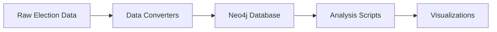
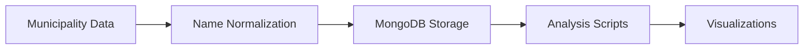

# Project Structure Documentation

## Author and Copyright
This analysis and implementation is the individual work of Lucy Sonberg. The project is built upon and developed from version 8 of Statistics Template JS (STJS) by NodeHill. While the foundation comes from this template, all analyses, conclusions, and enhanced implementations represent my personal work and findings.

**Copyright Notices**: 
- This work and its unique implementations, analyses, and conclusions are protected by copyright. No part of this project may be used, reproduced, or distributed without explicit permission from Lucy Sonberg.
- The underlying Statistics Template JS (STJS) has its own copyright © ironboy/NodeHill. Please refer to the template's copyright notice in the original repository for usage terms and conditions of the base template.

## Table of Contents
- [Overview](#overview)
- [Directory Structure](#directory-structure)
- [Key Components](#key-components)
- [Data Flow](#data-flow)
- [File Dependencies](#file-dependencies)
- [Template Components](#template-components)

## Overview
This document provides a comprehensive guide to the project structure of the Swedish Parliamentary Elections Analysis project. For other aspects of the project, see:
- [Project Documentation](./README.md) (in /docs)
- [Development Progress](./PROGRESS.md)
- [Analysis Conclusions](./CONCLUSIONS.md)
- [Visualization Standards](./party_colors.md)

Note: The root `/README.md` file contains the original STJS template documentation and should not be modified.

## Directory Structure

### Root Directory Components
```
swedish-parliamentary-elections-analysis/
├── js/               # Core application logic
├── src/              # Utility scripts and tools
├── data/             # Data files
├── docs/             # Project documentation
├── databases/        # Database configurations
├── course_materials/ # Course-related materials
├── backend/          # Server-side components
├── visualizations/   # Visualization components
└── tasks/           # Project management
```

### Core Directories in Detail

#### `js/` - Application Logic
Primary directory containing the main application code:
- `_menu.js`: Main navigation configuration
- `home.js`: Landing page implementation
- `*-analysis.js`: Various analysis implementations
- `libs/`: Third-party libraries

[View JS Implementation Details](PROGRESS.md#technical-implementation)

#### `src/utils/` - Utility Scripts
Contains data processing and analysis tools:
- `*_converter.js`: Data conversion utilities
- `*_analyzer.js`: Analysis tools
- `test-*.js`: Testing scripts
- `update-*.js`: Data update utilities

#### `data/` - Data Storage
Contains raw and processed data files:
- Election results
- Municipality information
- Education statistics
- Population data

[View Data Analysis Progress](PROGRESS.md#data-analysis-progress)

#### `docs/` - Documentation
Project documentation and technical details:
- `README.md`: Main project documentation
- `PROGRESS.md`: Development timeline and progress
- `CONCLUSIONS.md`: Analysis findings
- `party_colors.md`: Visualization standards
- `PROJECT_STRUCTURE.md`: This file

#### `databases/` - Database Configuration
Database connection and configuration files:
- SQLite databases
- Connection configurations
- Database schemas

[View Database Architecture](PROGRESS.md#database-architecture)

#### `course_materials/` - Course Resources
Contains course-specific materials and assignments:
- Original assignments
- Course requirements
- Reference materials

#### `backend/` - Server Components
Server-side implementation:
- Database connectors
- API implementations
- Server configuration

#### `visualizations/` - Data Visualization
Visualization components and configurations organized by analysis type:

```
visualizations/
├── county_analysis/        # County-level electoral analysis
│   └── county_detailed_*.png
├── education_analysis/     # Education level analysis
│   └── education_*.png
├── income_analysis/        # Income correlation analysis
│   └── income_correlation_*.png
├── screenshots/            # Application interface captures
│   └── screenshot_*.png
├── ui_elements/           # UI component images
│   └── ui_*_[YYMMDD].png
└── unemployment_analysis/ # Unemployment analysis
    └── unemployment_*.png
```

Each analysis directory contains:
- README.md with file descriptions
- Standardized naming conventions
- Visualization metadata
- Key statistical findings

[View Visualization Standards](party_colors.md)

#### `tasks/` - Project Management
Project planning and tracking:
- `TODO.md`: Current tasks and status
- Implementation plans
- Progress tracking

## Key Components

### Main Application Files
- `index.html`: Application entry point
- `package.json`: Project dependencies
- `chartSettings.json`: Visualization configuration

### Data Processing Chain
1. Raw data input (`data/`)
2. Processing scripts (`src/utils/`)
3. Database storage (`databases/`)
4. Analysis implementation (`js/`)
5. Visualization (`visualizations/`)

## Data Flow

### Election Data Flow


### Municipality Data Flow


## File Dependencies

### Key File Relationships
- `education_kommun_names.txt` & `education_municipalities.txt`:
  - Both used in education data processing
  - First file: Raw data from source
  - Second file: Normalized municipality names
  - Both required for data consistency checks

### Critical Dependencies
- Database configuration files
- Municipality name mapping files
- Party color configuration
- Chart settings

## Template Components
This project is built on Statistics Template JS (STJS) v8. Template components include:
- Basic directory structure
- Database connectivity
- Visualization framework
- Documentation templates

For template-specific documentation, refer to the root `/README.md` file.
For project-specific implementation details, see [Technical Implementation](./PROGRESS.md#technical-implementation) 